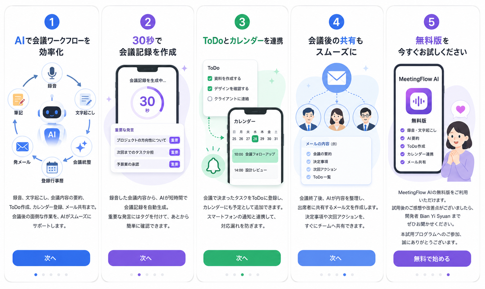
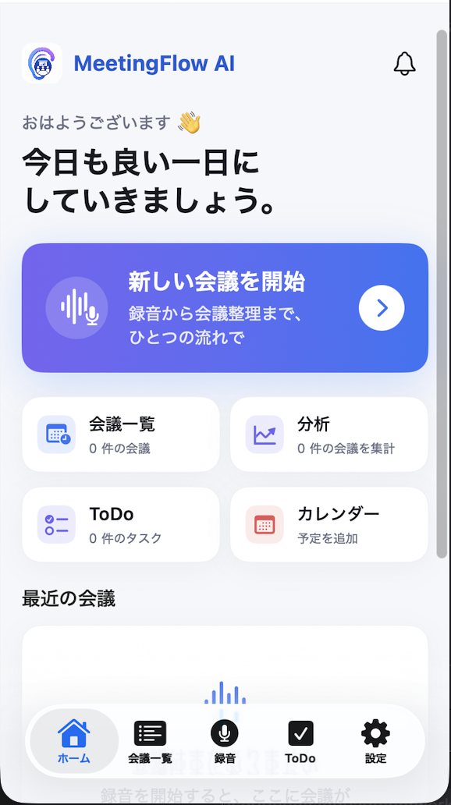
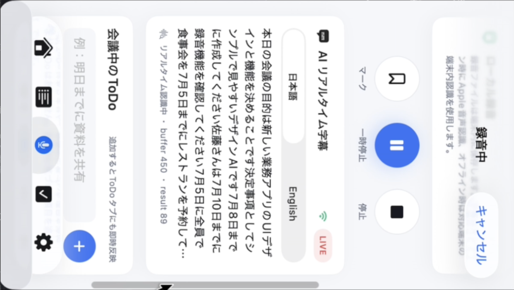
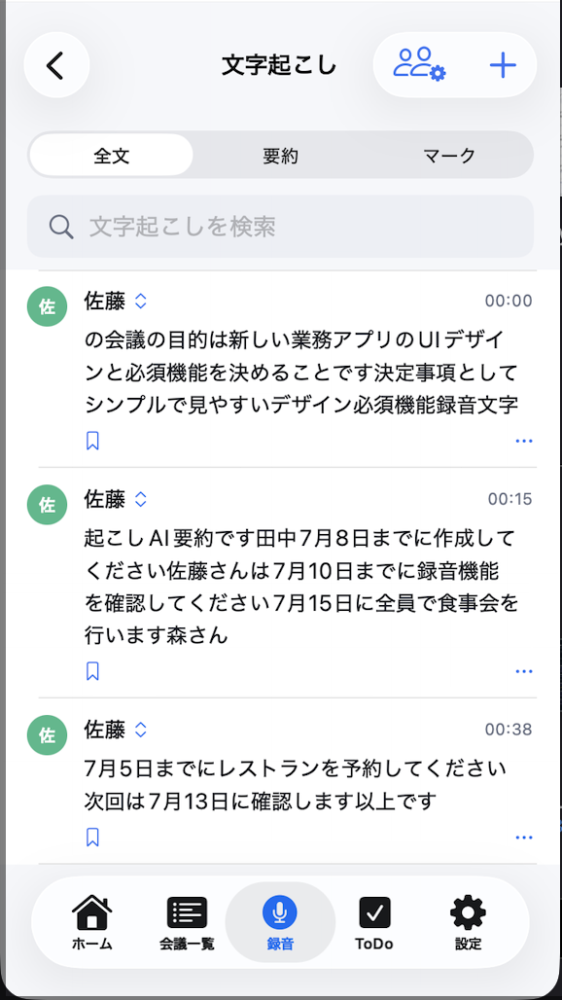
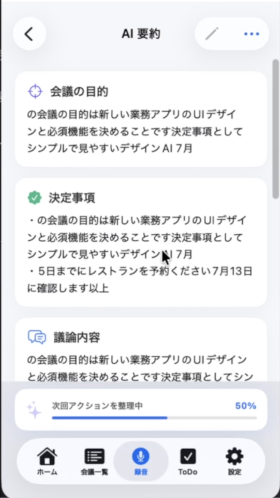
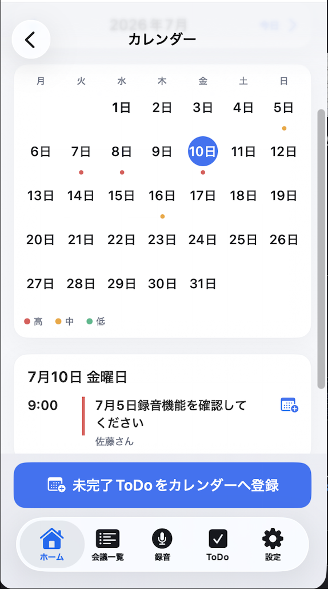
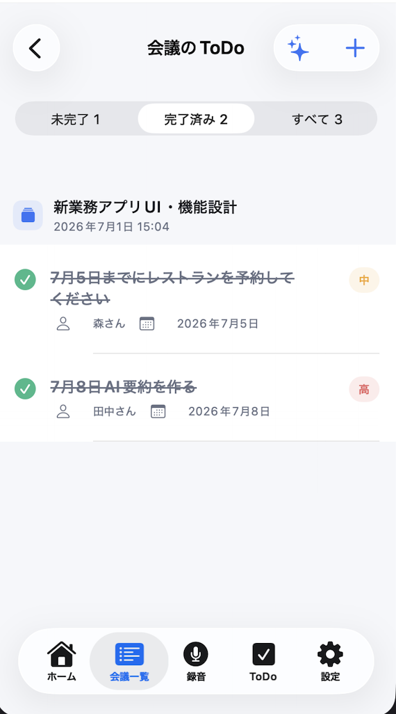
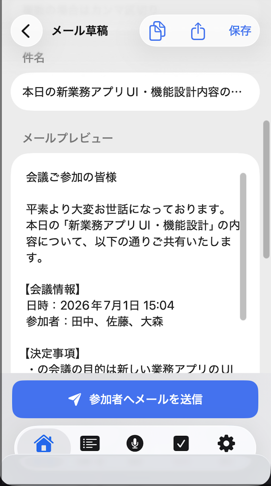
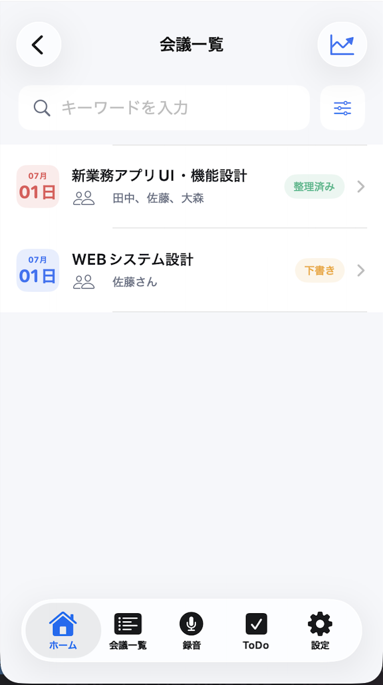
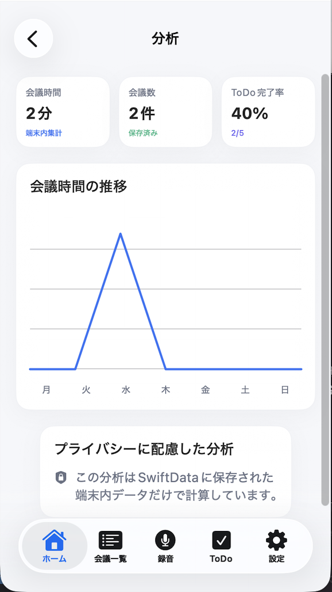

# MeetingFlowAI



## 概要

**MeetingFlowAI** は、日本語のビジネス会議を想定した、AI会議ワークフロー支援アプリです。

近年、AIを活用した業務効率化や AI Workflow が注目されています。  
本アプリは、会議中の録音から文字起こし、要約、ToDo抽出、カレンダー連携、メール共有、会議履歴管理までを一つの流れとして扱い、会議後の整理作業をスムーズにすることを目的に開発しました。

ユーザーは録音ボタンを押すだけで、会議内容を記録し、リアルタイム文字起こしを確認し、重要な発言や次回アクションを整理できます。  
単なる録音アプリではなく、「会議後にすぐ行動へ移せる情報」を作ることを重視しています。

---

## デモ動画

> MeetingFlowAI の動作デモです。

[MeetingFlowAI Demo](Assets/MeetingFlowAI_demo.mp4)

---

## コンセプト

会議では、録音・メモ・議事録作成・ToDo整理・共有作業など、多くの後処理が発生します。  
MeetingFlowAI は、これらの作業を一つのワークフローとしてまとめ、AIを活用して効率化することを目指しました。

本アプリのコンセプトは以下の通りです。

- 会議中は録音と重要ポイントの記録に集中する
- 会議中に日本語 / 英語のリアルタイム文字起こしを確認する
- 会議後は文字起こしと要約をすぐに確認できる
- 決定事項や次回アクションをToDoとして整理する
- ToDoの期限をカレンダー上で確認する
- 会議内容をメール草稿として共有できる
- 会議履歴や分析情報を後から見返せるようにする

---

## 主な機能

### 録音機能

会議中の音声を端末内に保存します。  
録音中は経過時間を表示し、重要な発言にはマークを付けることができます。

### リアルタイム文字起こし

Apple Speech Framework を利用し、録音中の音声をリアルタイムで文字起こしします。  
日本語と英語の字幕に対応しています。

対応言語：

- 日本語
- English

### 文字起こし履歴

録音後、会議ごとに文字起こし結果を保存できます。  
あとから会議内容を確認し、重要な発言を見返すことができます。

### AI要約

会議内容から以下の情報を整理することを想定しています。

- 会議の目的
- 決定事項
- 議論内容
- 課題
- 次回アクション
- 重要キーワード

現在のバージョンでは、外部AI APIに依存しないローカル処理を中心に設計しています。  
将来的には、自前のバックエンドを経由してAI APIと連携し、より高精度な要約機能へ拡張できる構成を想定しています。

### ToDo管理

会議中または会議後に発生したタスクをToDoとして登録できます。  
担当者、期限、優先度、完了状態を整理し、会議後の行動につなげることを目的としています。

### カレンダー管理

会議で発生したToDoの期限をカレンダー上で確認できます。  
未完了タスクをカレンダーへ登録することで、対応漏れを防ぐ設計にしています。

### メール草稿作成

会議内容、決定事項、ToDoを整理し、参加者へ共有するためのメール草稿を作成できます。  
会議後の情報共有をスムーズに行うことを目的としています。

### 会議履歴管理

過去の会議内容を一覧で管理できます。  
録音、文字起こし、要約、ToDo、ステータスを会議単位で確認できます。

### 分析機能

会議時間、会議数、ToDo完了率などを可視化します。  
端末内に保存されたデータをもとに、会議の傾向や作業状況を確認できます。

---

## 画面イメージ

MeetingFlowAI では、会議開始から録音、リアルタイム文字起こし、AI要約、ToDo管理、カレンダー登録、メール共有、会議分析までを一つの流れで扱えるように設計しています。

| ホーム | リアルタイム文字起こし | 文字起こし |
|---|---|---|
|  |  |  |

| AI要約 | カレンダー | ToDo管理 |
|---|---|---|
|  |  |  |

| メール草稿 | 会議一覧 | 分析 |
|---|---|---|
|  |  |  |

---

## 技術スタック

- Swift
- SwiftUI
- AVFoundation
- Speech Framework
- Network Framework
- SwiftData / ローカル保存
- iOS App Development
- Xcode

---

## 使用した主な技術

### AVFoundation

会議音声の録音処理に使用しています。  
録音開始、一時停止、停止、音声ファイル保存などの処理を実装しています。

### Speech Framework

リアルタイム文字起こしに使用しています。  
`SFSpeechRecognizer` と `SFSpeechAudioBufferRecognitionRequest` を利用し、録音中の音声を文字列として取得します。

### Network Framework

ネットワーク状態を監視し、オンライン時とオフライン時の表示や処理を切り替えるために使用しています。

### SwiftUI

画面構築に使用しています。  
ホーム画面、録音画面、会議一覧、文字起こし画面、AI要約画面、ToDo画面、カレンダー画面、メール草稿画面、分析画面などを SwiftUI で実装しています。

### SwiftData / ローカル保存

会議履歴、文字起こし、ToDo、分析データなどを端末内に保存する設計にしています。  
プライバシーに配慮し、端末内データを中心に処理できる構成を意識しています。

---

## アプリの特徴

### AI Workflow を意識した設計

MeetingFlowAI は、単に音声を録音するだけのアプリではありません。  
会議中に発生する情報を、録音、文字起こし、要約、ToDo、カレンダー、メール共有という一連の流れで整理することを重視しています。

### 会議後の作業を減らす

従来は、会議後に録音を聞き直し、議事録を作成し、タスクを整理する必要がありました。  
本アプリでは、会議内容をその場で記録し、後から必要な情報をすばやく確認できるようにしています。

### 日本語ビジネス環境を想定

UI文言や画面設計は、日本語のビジネス会議で使いやすいように設計しています。  
日本語の文字起こしだけでなく、英語の会議にも対応できるようにしています。

### 実用的なワークフロー

会議内容を「録音して終わり」にせず、以下のような流れで活用できることを重視しています。

```text
録音
↓
リアルタイム文字起こし
↓
文字起こし保存
↓
AI要約
↓
ToDo抽出
↓
カレンダー確認
↓
メール共有
↓
会議履歴・分析
```

---

## セキュリティ方針

本アプリでは、APIキーを iOS アプリ内に直接保存しない設計を前提としています。

外部AI APIと連携する場合は、以下の構成を想定しています。

```text
iOS App
↓
自前の Backend
↓
AI API
```

これにより、APIキーの漏洩リスクを避け、安全に機能拡張できるようにします。

また、会議音声や文字起こしデータはプライバシー性が高いため、端末内保存を中心とした設計を意識しています。

---

## 今後の改善予定

- 音声ファイルからの文字起こし
- AI要約精度の向上
- ToDoとカレンダーの連携強化
- 会議内容のメール共有機能の改善
- 話者識別
- PDF / Markdown 形式での会議レポート出力
- バックエンド経由でのAI API連携
- UI/UXのさらなる改善
- 多言語対応の拡張

---

## 開発目的

このアプリは、モバイルアプリ開発のポートフォリオ作品として制作しました。

特に以下の点を意識しています。

- SwiftUI による実用的なUI実装
- 録音、文字起こし、要約、ToDo管理を組み合わせたワークフロー設計
- AI時代の業務効率化を意識したアプリ企画
- 日本語ビジネスシーンを想定したUI/UX
- 将来的なAI API連携を見据えた安全な設計
- 端末内保存とプライバシーに配慮したデータ管理
- UI/UXデザイン経験を活かした画面設計

---

## 開発者

Bian Yi Syuan  
Mobile & Web Application Developer

GitHub: [bian-yi-syuan](https://github.com/bian-yi-syuan)
